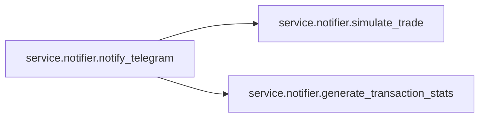

# Service Notifier

[_Documentation generated by Documatic_](https://www.documatic.com)

<!---Documatic-section-Codebase Structure-start--->
## Codebase Structure

<!---Documatic-block-system_architecture-start--->
```mermaid
None
```
<!---Documatic-block-system_architecture-end--->

# #
<!---Documatic-section-Codebase Structure-end--->

<!---Documatic-section-service.notifier.notify_telegram-start--->
## [service.notifier.notify_telegram](3-service_notifier.md#service.notifier.notify_telegram)

<!---Documatic-section-notify_telegram-start--->


### Object Calls

* [service.notifier.simulate_trade](3-service_notifier.md#service.notifier.simulate_trade)
* [service.notifier.generate_transaction_stats](3-service_notifier.md#service.notifier.generate_transaction_stats)

<!---Documatic-block-service.notifier.notify_telegram-start--->
<details>
	<summary><code>service.notifier.notify_telegram</code> code snippet</summary>

```python
async def notify_telegram():
    symbol = App.config['symbol']
    status = App.status
    signal = App.signal
    signal_side = signal.get('side')
    close_price = signal.get('close_price')
    buy_score = signal.get('buy_score')
    sell_score = signal.get('sell_score')
    close_time = signal.get('close_time')
    model = App.config['signal_model']
    buy_notify_threshold = model['buy_notify_threshold']
    sell_notify_threshold = model['sell_notify_threshold']
    buy_signal_threshold = model['buy_signal_threshold']
    sell_signal_threshold = model['sell_signal_threshold']
    trade_icon_step = model.get('trade_icon_step', 0)
    notify_frequency_minutes = model.get('notify_frequency_minutes', 1)
    if symbol == 'BTCUSDT':
        symbol_char = '₿'
    elif symbol == 'ETHUSDT':
        symbol_char = 'Ξ'
    else:
        symbol_char = symbol
    message = ''
    if signal_side == 'BUY':
        score_steps = np.abs(buy_score - buy_signal_threshold) // trade_icon_step if trade_icon_step else 0
        message = '🟢' * int(score_steps + 1) + f' *BUY: {symbol_char} {int(close_price):,} Score: {buy_score:+.2f}*'
    elif signal_side == 'SELL':
        score_steps = np.abs(sell_score - sell_signal_threshold) // trade_icon_step if trade_icon_step else 0
        message = '🔴' * int(score_steps + 1) + f' *SELL: {symbol_char} {int(close_price):,} Score: {-sell_score:+.2f}*'
    elif close_time.minute % notify_frequency_minutes == 0:
        if buy_score > sell_score:
            message = f'{symbol_char} {int(close_price):,} 📈{buy_score:+.2f}'
        else:
            message = f'{symbol_char} {int(close_price):,} 📉{-sell_score:+.2f}'
    message = message.replace('+', '%2B')
    if not message:
        return
    if buy_score < buy_notify_threshold and sell_score < sell_notify_threshold:
        return
    bot_token = App.config['telegram_bot_token']
    chat_id = App.config['telegram_chat_id']
    try:
        url = 'https://api.telegram.org/bot' + bot_token + '/sendMessage?chat_id=' + chat_id + '&parse_mode=markdown&text=' + message
        response = requests.get(url)
        response_json = response.json()
        if not response_json.get('ok'):
            log.error(f'Error sending notification.')
    except Exception as e:
        log.error(f'Error sending notification: {e}')
    transaction = await simulate_trade()
    if not transaction:
        return
    (profit, profit_percent, profit_descr, profit_percent_descr) = await generate_transaction_stats()
    if transaction.get('status') == 'SELL':
        message = '⚡💰 *SOLD: '
    elif transaction.get('status') == 'BUY':
        message = '⚡💰 *BOUGHT: '
    else:
        log.error(f'ERROR: Should not happen')
    message += f' Profit: {profit_percent:.2f}% {profit:.2f}₮*'
    try:
        url = 'https://api.telegram.org/bot' + bot_token + '/sendMessage?chat_id=' + chat_id + '&parse_mode=markdown&text=' + message
        response = requests.get(url)
        response_json = response.json()
        if not response_json.get('ok'):
            log.error(f'Error sending notification.')
    except Exception as e:
        log.error(f'Error sending notification: {e}')
    if transaction.get('status') == 'SELL':
        message = '↗ *LONG transactions stats (4 weeks)*\n'
    elif transaction.get('status') == 'BUY':
        message = '↘ *SHORT transactions stats (4 weeks)*\n'
    else:
        log.error(f'ERROR: Should not happen')
    message += f"🔸sum={profit_percent_descr['count'] * profit_percent_descr['mean']:.2f}% 🔸count={int(profit_percent_descr['count'])}\n"
    message += f"🔸mean={profit_percent_descr['mean']:.2f}% 🔸std={profit_percent_descr['std']:.2f}%\n"
    message += f"🔸min={profit_percent_descr['min']:.2f}% 🔸median={profit_percent_descr['50%']:.2f}% 🔸max={profit_percent_descr['max']:.2f}%\n"
    try:
        url = 'https://api.telegram.org/bot' + bot_token + '/sendMessage?chat_id=' + chat_id + '&parse_mode=markdown&text=' + message
        response = requests.get(url)
        response_json = response.json()
        if not response_json.get('ok'):
            log.error(f'Error sending notification.')
    except Exception as e:
        log.error(f'Error sending notification: {e}')
```
</details>
<!---Documatic-block-service.notifier.notify_telegram-end--->
<!---Documatic-section-notify_telegram-end--->

# #
<!---Documatic-section-service.notifier.notify_telegram-end--->

<!---Documatic-section-service.notifier.simulate_trade-start--->
## [service.notifier.simulate_trade](3-service_notifier.md#service.notifier.simulate_trade)

<!---Documatic-section-simulate_trade-start--->
<!---Documatic-block-service.notifier.simulate_trade-start--->
<details>
	<summary><code>service.notifier.simulate_trade</code> code snippet</summary>

```python
async def simulate_trade():
    symbol = App.config['symbol']
    status = App.status
    signal = App.signal
    signal_side = signal.get('side')
    close_price = signal.get('close_price')
    buy_score = signal.get('buy_score')
    sell_score = signal.get('sell_score')
    close_time = signal.get('close_time')
    t_status = App.transaction.get('status')
    t_price = App.transaction.get('price')
    if signal_side == 'BUY' and (not t_status or t_status == 'SELL'):
        profit = t_price - close_price if t_price else 0.0
        t_dict = dict(timestamp=str(close_time), price=close_price, profit=profit, status='BUY')
    elif signal_side == 'SELL' and (not t_status or t_status == 'BUY'):
        profit = close_price - t_price if t_price else 0.0
        t_dict = dict(timestamp=str(close_time), price=close_price, profit=profit, status='SELL')
    else:
        return None
    App.transaction = t_dict
    with open(transaction_file, 'a+') as f:
        f.write(','.join([f'{v:.2f}' if isinstance(v, float) else str(v) for v in t_dict.values()]) + '\n')
    return t_dict
```
</details>
<!---Documatic-block-service.notifier.simulate_trade-end--->
<!---Documatic-section-simulate_trade-end--->

# #
<!---Documatic-section-service.notifier.simulate_trade-end--->

<!---Documatic-section-service.notifier.generate_transaction_stats-start--->
## [service.notifier.generate_transaction_stats](3-service_notifier.md#service.notifier.generate_transaction_stats)

<!---Documatic-section-generate_transaction_stats-start--->
<!---Documatic-block-service.notifier.generate_transaction_stats-start--->
<details>
	<summary><code>service.notifier.generate_transaction_stats</code> code snippet</summary>

```python
async def generate_transaction_stats():
    df = pd.read_csv(transaction_file, parse_dates=[0], header=None, names=['timestamp', 'close', 'profit', 'status'])
    mask = df['timestamp'] >= datetime.now() - timedelta(weeks=4)
    df = df[max(mask.idxmax() - 1, 0):]
    df['prev_close'] = df['close'].shift()
    df['profit_percent'] = df.apply(lambda x: 100.0 * x['profit'] / x['prev_close'], axis=1)
    df = df.iloc[1:]
    long_df = df[df['status'] == 'SELL']
    short_df = df[df['status'] == 'BUY']
    last_transaction = df.iloc[-1]
    transaction_dt = last_transaction['timestamp']
    transaction_type = last_transaction['status']
    profit = last_transaction['profit']
    profit_percent = last_transaction['profit_percent']
    if transaction_type == 'SELL':
        df2 = long_df
    elif transaction_type == 'BUY':
        df2 = short_df
    profit_sum = df2['profit'].sum()
    profit_descr = df2['profit'].describe()
    profit_percent_sum = df2['profit_percent'].sum()
    profit_percent_descr = df2['profit_percent'].describe()
    return (profit, profit_percent, profit_descr, profit_percent_descr)
```
</details>
<!---Documatic-block-service.notifier.generate_transaction_stats-end--->
<!---Documatic-section-generate_transaction_stats-end--->

# #
<!---Documatic-section-service.notifier.generate_transaction_stats-end--->

[_Documentation generated by Documatic_](https://www.documatic.com)