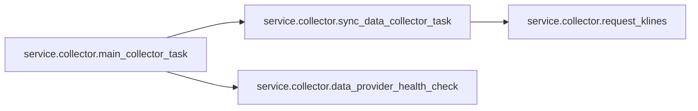
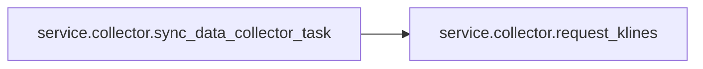

# Service Collector

[_Documentation generated by Documatic_](https://www.documatic.com)

<!---Documatic-section-Codebase Structure-start--->
## Codebase Structure

<!---Documatic-block-system_architecture-start--->
```mermaid
None
```
<!---Documatic-block-system_architecture-end--->

# #
<!---Documatic-section-Codebase Structure-end--->

<!---Documatic-section-service.collector.main_collector_task-start--->
## [service.collector.main_collector_task](6-service_collector.md#service.collector.main_collector_task)

<!---Documatic-section-main_collector_task-start--->


### Object Calls

* [service.collector.sync_data_collector_task](6-service_collector.md#service.collector.sync_data_collector_task)
* [service.collector.data_provider_health_check](6-service_collector.md#service.collector.data_provider_health_check)

<!---Documatic-block-service.collector.main_collector_task-start--->
<details>
	<summary><code>service.collector.main_collector_task</code> code snippet</summary>

```python
async def main_collector_task():
    symbol = App.config['symbol']
    (startTime, endTime) = get_interval('1m')
    now_ts = now_timestamp()
    log.info(f'===> Start collector task. Timestamp {now_ts}. Interval [{startTime},{endTime}].')
    if data_provider_problems_exist():
        await data_provider_health_check()
        if data_provider_problems_exist():
            log.error(f'Problems with the data provider server found. No signaling, no trade. Will try next time.')
            return 1
    res = await sync_data_collector_task()
    if res > 0:
        log.error(f'Problem getting data from the server. No signaling, no trade. Will try next time.')
        return 1
    log.info(f'<=== End collector task.')
    return 0
```
</details>
<!---Documatic-block-service.collector.main_collector_task-end--->
<!---Documatic-section-main_collector_task-end--->

# #
<!---Documatic-section-service.collector.main_collector_task-end--->

<!---Documatic-section-service.collector.sync_data_collector_task-start--->
## [service.collector.sync_data_collector_task](6-service_collector.md#service.collector.sync_data_collector_task)

<!---Documatic-section-sync_data_collector_task-start--->


### Object Calls

* [service.collector.request_klines](6-service_collector.md#service.collector.request_klines)

<!---Documatic-block-service.collector.sync_data_collector_task-start--->
<details>
	<summary><code>service.collector.sync_data_collector_task</code> code snippet</summary>

```python
async def sync_data_collector_task():
    data_sources = App.config.get('data_sources', [])
    symbols = [x.get('folder') for x in data_sources]
    if not symbols:
        symbols = [App.config['symbol']]
    missing_klines_counts = [App.analyzer.get_missing_klines_count(sym) for sym in symbols]
    tasks = [asyncio.create_task(request_klines(s, '1m', c)) for (c, s) in zip(missing_klines_counts, symbols)]
    results = {}
    timeout = 10
    for fut in asyncio.as_completed(tasks, timeout=timeout):
        res = None
        try:
            res = await fut
        except TimeoutError as te:
            log.warning(f'Timeout {timeout} seconds when requesting kline data.')
            return 1
        except Exception as e:
            log.warning(f'Exception when requesting kline data.')
            return 1
        if res and res.keys():
            results.update(res)
            try:
                added_count = App.analyzer.store_klines(res)
            except Exception as e:
                log.error(f'Error storing kline result in the database. Exception: {e}')
                return 1
        else:
            log.error('Received empty or wrong result from klines request.')
            return 1
    return 0
```
</details>
<!---Documatic-block-service.collector.sync_data_collector_task-end--->
<!---Documatic-section-sync_data_collector_task-end--->

# #
<!---Documatic-section-service.collector.sync_data_collector_task-end--->

<!---Documatic-section-service.collector.request_klines-start--->
## [service.collector.request_klines](6-service_collector.md#service.collector.request_klines)

<!---Documatic-section-request_klines-start--->
<!---Documatic-block-service.collector.request_klines-start--->
<details>
	<summary><code>service.collector.request_klines</code> code snippet</summary>

```python
async def request_klines(symbol, freq, limit):
    klines_per_request = 400
    now_ts = now_timestamp()
    (startTime, endTime) = get_interval(freq)
    klines = []
    try:
        if limit <= klines_per_request:
            klines = App.client.get_klines(symbol=symbol, interval=freq, limit=limit, endTime=now_ts)
        else:
            start_ts = now_ts - (limit + 1) * 60000
            klines = App.client.get_historical_klines(symbol=symbol, interval=freq, start_str=start_ts, end_str=now_ts)
    except BinanceRequestException as bre:
        log.error(f'BinanceRequestException while requesting klines: {bre}')
        return {}
    except BinanceAPIException as bae:
        log.error(f'BinanceAPIException while requesting klines: {bae}')
        return {}
    except Exception as e:
        log.error(f'Exception while requesting klines: {e}')
        return {}
    klines_full = [kl for kl in klines if kl[0] < startTime]
    last_full_kline = klines_full[-1]
    last_full_kline_ts = last_full_kline[0]
    if last_full_kline_ts != startTime - 60000:
        log.error(f'UNEXPECTED RESULT: Last full kline timestamp {last_full_kline_ts} is not equal to previous full interval start {startTime - 60000}. Maybe some results are missing and there are gaps.')
    return {symbol: klines_full}
```
</details>
<!---Documatic-block-service.collector.request_klines-end--->
<!---Documatic-section-request_klines-end--->

# #
<!---Documatic-section-service.collector.request_klines-end--->

<!---Documatic-section-service.collector.data_provider_health_check-start--->
## [service.collector.data_provider_health_check](6-service_collector.md#service.collector.data_provider_health_check)

<!---Documatic-section-data_provider_health_check-start--->
<!---Documatic-block-service.collector.data_provider_health_check-start--->
<details>
	<summary><code>service.collector.data_provider_health_check</code> code snippet</summary>

```python
async def data_provider_health_check():
    symbol = App.config['symbol']
    system_status = App.client.get_system_status()
    if not system_status or system_status.get('status') != 0:
        App.server_status = 1
        return 1
    App.server_status = 0
    return 0
```
</details>
<!---Documatic-block-service.collector.data_provider_health_check-end--->
<!---Documatic-section-data_provider_health_check-end--->

# #
<!---Documatic-section-service.collector.data_provider_health_check-end--->

[_Documentation generated by Documatic_](https://www.documatic.com)