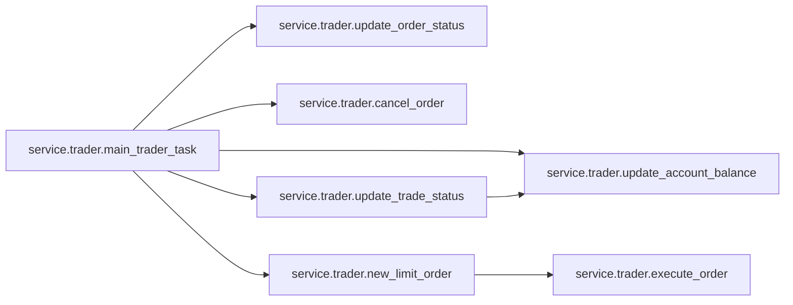
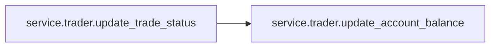
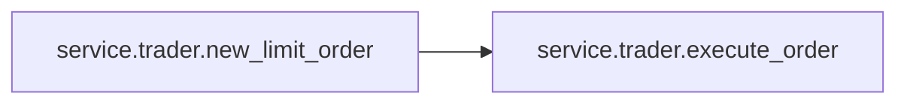

# Service Trader

[_Documentation generated by Documatic_](https://www.documatic.com)

<!---Documatic-section-Codebase Structure-start--->
## Codebase Structure

<!---Documatic-block-system_architecture-start--->
```mermaid
None
```
<!---Documatic-block-system_architecture-end--->

# #
<!---Documatic-section-Codebase Structure-end--->

<!---Documatic-section-service.trader.main_trader_task-start--->
## [service.trader.main_trader_task](7-service_trader.md#service.trader.main_trader_task)

<!---Documatic-section-main_trader_task-start--->


### Object Calls

* [service.trader.update_account_balance](7-service_trader.md#service.trader.update_account_balance)
* [service.trader.update_order_status](7-service_trader.md#service.trader.update_order_status)
* [service.trader.cancel_order](7-service_trader.md#service.trader.cancel_order)
* [service.trader.new_limit_order](7-service_trader.md#service.trader.new_limit_order)
* [service.trader.update_trade_status](7-service_trader.md#service.trader.update_trade_status)

<!---Documatic-block-service.trader.main_trader_task-start--->
<details>
	<summary><code>service.trader.main_trader_task</code> code snippet</summary>

```python
async def main_trader_task():
    symbol = App.config['symbol']
    (startTime, endTime) = get_interval('1m')
    now_ts = now_timestamp()
    log.info(f'===> Start trade task. Timestamp {now_ts}. Interval [{startTime},{endTime}].')
    status = App.status
    if status == 'BUYING' or status == 'SELLING':
        order_status = await update_order_status()
        order = App.order
        if not order or not order_status:
            await update_trade_status()
            log.error(f'Bad order or order status {order}. Full reset/init needed.')
            return
        if order_status == ORDER_STATUS_FILLED:
            log.info(f'Limit order filled. {order}')
            if status == 'BUYING':
                print(f'===> BOUGHT: {order}')
                App.status = 'BOUGHT'
            elif status == 'SELLING':
                print(f'<=== SOLD: {order}')
                App.status = 'SOLD'
            log.info(f'New trade mode: {App.status}')
        elif order_status == ORDER_STATUS_REJECTED or order_status == ORDER_STATUS_EXPIRED or order_status == ORDER_STATUS_CANCELED:
            log.error(f'Failed to fill order with order status {order_status}')
            if status == 'BUYING':
                App.status = 'SOLD'
            elif status == 'SELLING':
                App.status = 'BOUGHT'
            log.info(f'New trade mode: {App.status}')
        elif order_status == ORDER_STATUS_PENDING_CANCEL:
            return
        elif order_status == ORDER_STATUS_PARTIALLY_FILLED:
            pass
        elif order_status == ORDER_STATUS_NEW:
            pass
        else:
            pass
    elif status == 'BOUGHT' or status == 'SOLD':
        pass
    else:
        log.error(f'Wrong status value {status}.')
    status = App.status
    signal = App.signal
    signal_side = signal.get('side')
    if status == 'BUYING' or status == 'SELLING':
        order_status = await cancel_order()
        if not order_status:
            await update_trade_status()
            return
        await asyncio.sleep(1)
        if status == 'BUYING':
            App.status = 'SOLD'
        elif status == 'SELLING':
            App.status = 'BOUGHT'
    status = App.status
    if signal_side == 'BUY':
        print(f'===> BUY SIGNAL {signal}: ')
    elif signal_side == 'SELL':
        print(f'<=== SELL SIGNAL: {signal}')
    else:
        print(f"SCORE: {signal.get('score'):+.3f}. PRICE: {signal.get('close_price'):.2f}")
    await update_account_balance()
    if status == 'SOLD' and signal_side == 'BUY':
        await new_limit_order(side=SIDE_BUY)
        if App.config['trader']['no_trades_only_data_processing']:
            print("SKIP TRADING due to 'no_trades_only_data_processing' parameter True")
        else:
            App.status = 'BUYING'
    elif status == 'BOUGHT' and signal_side == 'SELL':
        await new_limit_order(side=SIDE_SELL)
        if App.config['trader']['no_trades_only_data_processing']:
            print("SKIP TRADING due to 'no_trades_only_data_processing' parameter True")
        else:
            App.status = 'SELLING'
    log.info(f'<=== End trade task.')
    return
```
</details>
<!---Documatic-block-service.trader.main_trader_task-end--->
<!---Documatic-section-main_trader_task-end--->

# #
<!---Documatic-section-service.trader.main_trader_task-end--->

<!---Documatic-section-service.trader.update_trade_status-start--->
## [service.trader.update_trade_status](7-service_trader.md#service.trader.update_trade_status)

<!---Documatic-section-update_trade_status-start--->


### Object Calls

* [service.trader.update_account_balance](7-service_trader.md#service.trader.update_account_balance)

<!---Documatic-block-service.trader.update_trade_status-start--->
<details>
	<summary><code>service.trader.update_trade_status</code> code snippet</summary>

```python
async def update_trade_status():
    symbol = App.config['symbol']
    try:
        open_orders = App.client.get_open_orders(symbol=symbol)
    except Exception as e:
        log.error(f"Binance exception in 'get_open_orders' {e}")
        return
    if not open_orders:
        await update_account_balance()
        last_kline = App.analyzer.get_last_kline(symbol)
        last_close_price = to_decimal(last_kline[4])
        base_quantity = App.base_quantity
        btc_assets_in_usd = base_quantity * last_close_price
        usd_assets = App.quote_quantity
        if usd_assets >= btc_assets_in_usd:
            App.status = 'SOLD'
        else:
            App.status = 'BOUGHT'
    elif len(open_orders) == 1:
        order = open_orders[0]
        if order.get('side') == SIDE_SELL:
            App.status = 'SELLING'
        elif order.get('side') == SIDE_BUY:
            App.status = 'BUYING'
        else:
            log.error(f'Neither SELL nor BUY side of the order {order}.')
            return None
    else:
        log.error(f'Wrong state. More than one open order. Fix manually.')
        return None
```
</details>
<!---Documatic-block-service.trader.update_trade_status-end--->
<!---Documatic-section-update_trade_status-end--->

# #
<!---Documatic-section-service.trader.update_trade_status-end--->

<!---Documatic-section-service.trader.update_order_status-start--->
## [service.trader.update_order_status](7-service_trader.md#service.trader.update_order_status)

<!---Documatic-section-update_order_status-start--->
<!---Documatic-block-service.trader.update_order_status-start--->
<details>
	<summary><code>service.trader.update_order_status</code> code snippet</summary>

```python
async def update_order_status():
    symbol = App.config['symbol']
    order = App.order
    order_id = order.get('orderId', 0) if order else 0
    if not order_id:
        log.error(f'Wrong state or use: check order status cannot find the order id.')
        return None
    try:
        new_order = App.client.get_order(symbol=symbol, orderId=order_id)
    except Exception as e:
        log.error(f"Binance exception in 'get_order' {e}")
        return
    if new_order:
        order.update(new_order)
    else:
        return None
    return order['status']
```
</details>
<!---Documatic-block-service.trader.update_order_status-end--->
<!---Documatic-section-update_order_status-end--->

# #
<!---Documatic-section-service.trader.update_order_status-end--->

<!---Documatic-section-service.trader.update_account_balance-start--->
## [service.trader.update_account_balance](7-service_trader.md#service.trader.update_account_balance)

<!---Documatic-section-update_account_balance-start--->
<!---Documatic-block-service.trader.update_account_balance-start--->
<details>
	<summary><code>service.trader.update_account_balance</code> code snippet</summary>

```python
async def update_account_balance():
    try:
        balance = App.client.get_asset_balance(asset=App.config['base_asset'])
    except Exception as e:
        log.error(f"Binance exception in 'get_asset_balance' {e}")
        return
    App.base_quantity = Decimal(balance.get('free', '0.00000000'))
    try:
        balance = App.client.get_asset_balance(asset=App.config['quote_asset'])
    except Exception as e:
        log.error(f"Binance exception in 'get_asset_balance' {e}")
        return
    App.quote_quantity = Decimal(balance.get('free', '0.00000000'))
    pass
```
</details>
<!---Documatic-block-service.trader.update_account_balance-end--->
<!---Documatic-section-update_account_balance-end--->

# #
<!---Documatic-section-service.trader.update_account_balance-end--->

<!---Documatic-section-service.trader.cancel_order-start--->
## [service.trader.cancel_order](7-service_trader.md#service.trader.cancel_order)

<!---Documatic-section-cancel_order-start--->
<!---Documatic-block-service.trader.cancel_order-start--->
<details>
	<summary><code>service.trader.cancel_order</code> code snippet</summary>

```python
async def cancel_order():
    symbol = App.config['symbol']
    order = App.order
    order_id = order.get('orderId', 0) if order else 0
    if order_id == 0:
        return None
    try:
        log.info(f'Cancelling order id {order_id}')
        new_order = App.client.cancel_order(symbol=symbol, orderId=order_id)
    except Exception as e:
        log.error(f"Binance exception in 'cancel_order' {e}")
        return None
    if new_order:
        order.update(new_order)
    else:
        return None
    return order['status']
```
</details>
<!---Documatic-block-service.trader.cancel_order-end--->
<!---Documatic-section-cancel_order-end--->

# #
<!---Documatic-section-service.trader.cancel_order-end--->

<!---Documatic-section-service.trader.new_limit_order-start--->
## [service.trader.new_limit_order](7-service_trader.md#service.trader.new_limit_order)

<!---Documatic-section-new_limit_order-start--->


### Object Calls

* [service.trader.execute_order](7-service_trader.md#service.trader.execute_order)

<!---Documatic-block-service.trader.new_limit_order-start--->
<details>
	<summary><code>service.trader.new_limit_order</code> code snippet</summary>

```python
async def new_limit_order(side):
    symbol = App.config['symbol']
    now_ts = now_timestamp()
    last_kline = App.analyzer.get_last_kline(symbol)
    last_close_price = to_decimal(last_kline[4])
    if not last_close_price:
        log.error(f'Cannot determine last close price in order to create a market buy order.')
        return None
    price_adjustment = App.config['trader']['limit_price_adjustment']
    if side == SIDE_BUY:
        price = last_close_price * Decimal(1.0 - price_adjustment)
    elif side == SIDE_SELL:
        price = last_close_price * Decimal(1.0 + price_adjustment)
    price_str = round_str(price, 2)
    price = Decimal(price_str)
    if side == SIDE_BUY:
        quantity = App.quote_quantity
        percentage_used_for_trade = App.config['trader']['percentage_used_for_trade']
        quantity = quantity * percentage_used_for_trade / Decimal(100.0)
        quantity = quantity / price
    elif side == SIDE_SELL:
        quantity = App.base_quantity
    quantity_str = round_down_str(quantity, 6)
    order_spec = dict(symbol=symbol, side=side, type=ORDER_TYPE_LIMIT, timeInForce=TIME_IN_FORCE_GTC, quantity=quantity_str, price=price_str)
    if App.config['trader']['no_trades_only_data_processing']:
        print(f'NOT executed order spec: {order_spec}')
    else:
        order = execute_order(order_spec)
    App.order = order
    App.order_time = now_ts
    return order
```
</details>
<!---Documatic-block-service.trader.new_limit_order-end--->
<!---Documatic-section-new_limit_order-end--->

# #
<!---Documatic-section-service.trader.new_limit_order-end--->

<!---Documatic-section-service.trader.execute_order-start--->
## [service.trader.execute_order](7-service_trader.md#service.trader.execute_order)

<!---Documatic-section-execute_order-start--->
<!---Documatic-block-service.trader.execute_order-start--->
<details>
	<summary><code>service.trader.execute_order</code> code snippet</summary>

```python
def execute_order(order: dict):
    if App.config['trader']['test_order_before_submit']:
        try:
            log.info(f'Submitting test order: {order}')
            test_response = App.client.create_test_order(**order)
        except Exception as e:
            log.error(f"Binance exception in 'create_test_order' {e}")
            return
    if App.config['trader']['simulate_order_execution']:
        print(order)
        print(App.signal)
        pass
    else:
        try:
            log.info(f'Submitting order: {order}')
            order = App.client.create_order(**order)
        except Exception as e:
            log.error(f"Binance exception in 'create_order' {e}")
            return
        if not order or not order.get('status'):
            return None
    return order
```
</details>
<!---Documatic-block-service.trader.execute_order-end--->
<!---Documatic-section-execute_order-end--->

# #
<!---Documatic-section-service.trader.execute_order-end--->

[_Documentation generated by Documatic_](https://www.documatic.com)